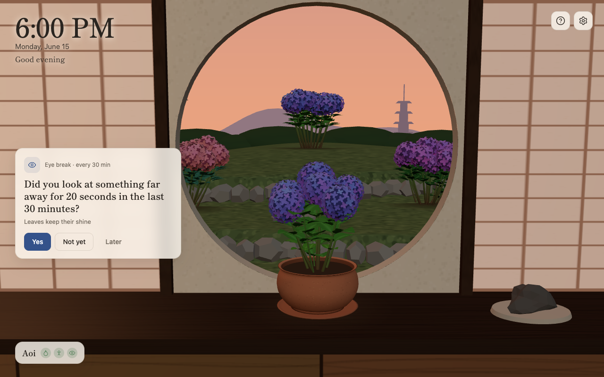
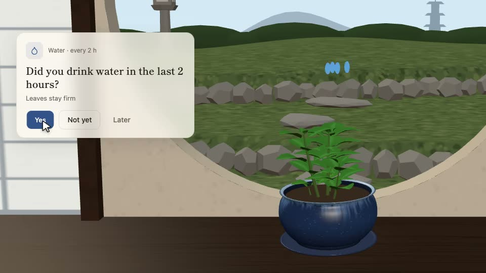
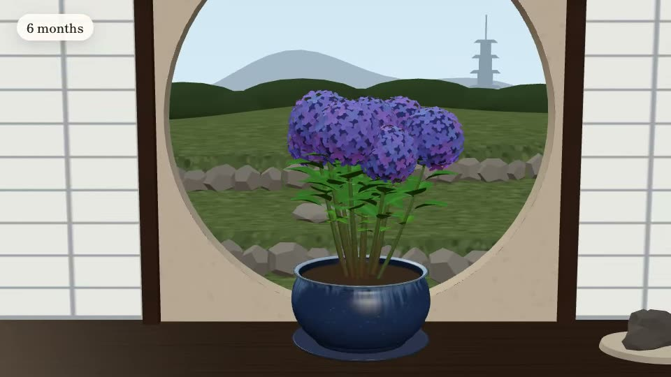
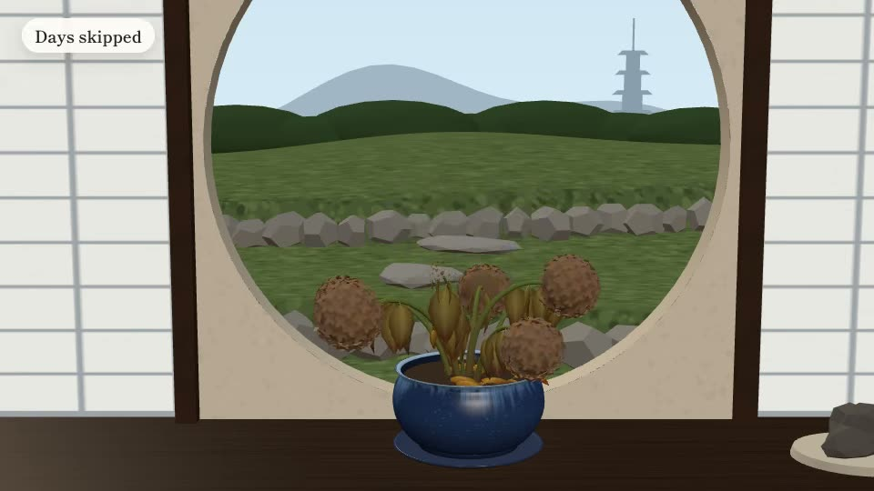
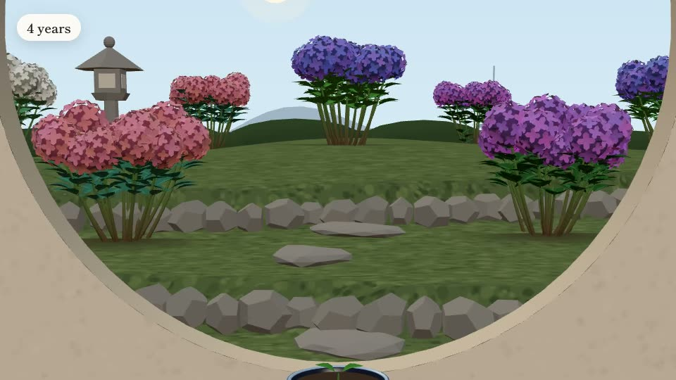

# Marumado 丸窓

**A tiny ajisai (hydrangea) on a Kyoto windowsill that grows with your healthy work habits.**
A new-tab extension for Chrome and Edge. Free, open source, and nothing ever leaves your browser.
**[marumado.danielkishimoto.com](https://marumado.danielkishimoto.com/?utm_source=github&utm_medium=readme&utm_campaign=marumado&utm_content=site)** · [Download the latest release](../../releases)



## Why

Long desk days wear us down quietly: no water, no breaks, eyes on a screen for hours. Small habits, kept every day, change how we feel, but they're easy to forget and hard to see.

Marumado makes them visible. Every new tab is a glance out of a round window (*marumado*, 丸窓) at a plant that depends on you, a little like a tamagotchi, without the guilt: it can droop, but it never dies.

## How it works

| | |
|---|---|
|  | **One quick question** on each new tab, only during your work hours: *"Did you drink water in the last 2 hours?"* Answer Yes, Not yet or Later. |
|  | **Say Yes and it grows**: new leaves, bigger pots, then blooms. About 6 months of care to its full size. |
|  | **Skip it and it droops**, but it never dies: a few days of care always bring it back. |
|  | **After 6 months it moves to the garden** outside the window and keeps growing there. A new seed begins, in a colour you pick. |

You choose up to 5 habits from a desk-friendly catalog (water, stretch, eye breaks, posture, a short walk, daylight, breathing, a real lunch, wrists, shutting down on time), each with its own interval, plus your work hours and days. Questions never appear outside them, and vacation mode pauses everything.

## Install

### Download (easiest)

1. Download the latest `marumado-x.y.z-chrome.zip` from [Releases](../../releases) and unzip it.
2. Open `chrome://extensions` (or `edge://extensions`) and turn on **Developer mode**.
3. Click **Load unpacked** and pick the unzipped folder.
4. Open a new tab. If the browser asks whether to keep the new-tab change, choose **Keep it**.

### Build from source

```bash
git clone https://github.com/kishidek/marumado.git
cd marumado
npm install
npm run build        # → .output/chrome-mv3
```

Then load `.output/chrome-mv3` as above. `.output/` is a hidden folder: in the macOS file picker press <kbd>⌘</kbd> <kbd>⇧</kbd> <kbd>.</kbd> to show it.

Not on the Chrome Web Store (yet). Requires Chrome or Edge 111+.

## Privacy

- Everything is stored in your browser (`chrome.storage.local`). No account, no analytics, no network requests.
- The only permission is `storage`.
- Backups are files you export yourself (Settings → Export backup). Uninstalling the extension or clearing browser data deletes your plants, so export now and then.
- If something breaks, Settings → Diagnostics shows errors recorded locally; they're included in your backup only so *you* can share them if you want.

## FAQ

- **My new tab still shows another extension.** Only one extension can replace the new tab. Disable the other one in `chrome://extensions`.
- **No plant in Incognito.** Browsers don't let extensions replace the Incognito new tab.
- **No questions right now.** They only appear during your work hours and workdays (Settings), never on vacation.
- **I see a flat round window instead of the 3D room.** WebGL is off in your browser (hardware acceleration disabled or blocked). Everything else still works. Settings → Light mode helps on slower computers.

## For developers

**Stack:** [WXT](https://wxt.dev) (Manifest V3) · TypeScript (no UI framework) · [three.js](https://threejs.org) · Vitest · Playwright.
The plant and the garden are fully procedural: every visual is a function of *days of care × health*.

| Command | What it does |
|---|---|
| `npm run dev` | Dev mode: opens Chrome with the extension and reloads on save. Shows **Dev controls** (sky hour, plant age/health, time travel) |
| `npm run build` / `npm run zip` | Production build in `.output/chrome-mv3` / a zip for sharing |
| `npm run compile` | Type-check |
| `npm test` · `npm run test:tz` | Engine tests (in 3 time zones) |
| `npm run test:e2e` | End-to-end tests on the real unpacked extension |
| `npm run test:visual` | Visual regression: 24 scenes with a frozen clock (`npm run visual:sheet` builds a review page) |
| `npm run lab` | Plant lab: tune the ajisai's growth × health; `/lab/garden.html` previews the garden |
| `npm run render:help` | Re-renders the help modal's clips (needs `ffmpeg`) |

```
src/
  entrypoints/newtab/   the new-tab page
  engine/               pure TS: answers → health & growth, scheduler, garden, backups (no DOM)
  storage/              chrome.storage with cross-tab locking, compaction, local diagnostics
  plant/  scene/        procedural ajisai; the room, round window, sky and garden
  ui/                   onboarding, settings, help, dialogs
tests/                  engine (Vitest), e2e + visual + clips (Playwright)
docs/                   how it was planned and built: start at docs/README.md
```

Contributions are welcome: see [CONTRIBUTING.md](CONTRIBUTING.md). The [docs](docs/README.md) hold the plans, the tracker, every bug with its cause and fix, and the QA matrix.

## Credits

Made by [Daniel Kishimoto](https://danielkishimoto.com/?utm_source=github&utm_medium=readme&utm_campaign=marumado&utm_content=credits).
Bundled: three.js (MIT), Shippori Mincho font (OFL-1.1), Lucide icons (ISC).

## License

[MIT](LICENSE)
